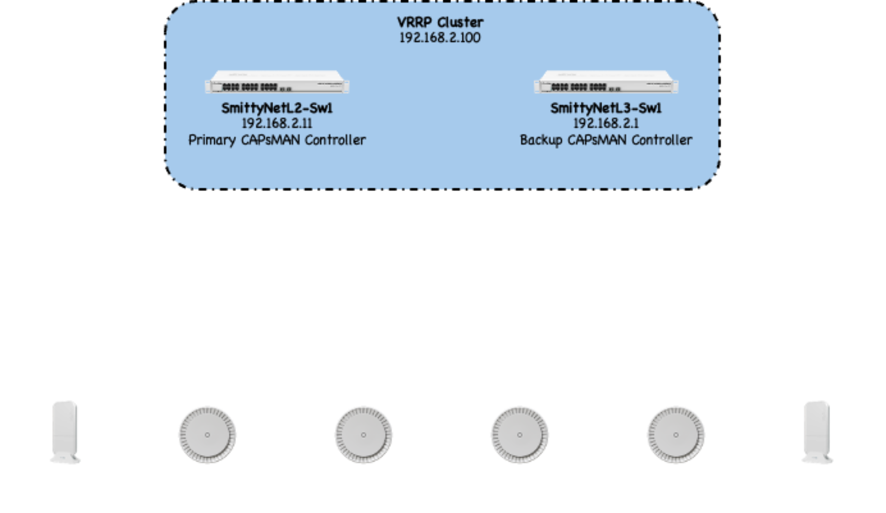

[← Back to Home](./index.md)

# Home Network & Home Lab

This page outlines the design of my home network (SmittyNet) and the home lab that runs inside it. The diagram below shows the overall layout, including the switching and routing foundation, the VLAN structure, and how the lab systems connect.

---

## Architecture Diagram

  

    <button type="button" id="diag-zoom-in">Zoom In</button>
    <button type="button" id="diag-zoom-out">Zoom Out</button>
    <button type="button" id="diag-reset">Reset</button>
  

  

    
  

<!-- Panzoom library -->

*Use the controls above to zoom and pan around the diagram. Scroll the mouse wheel over the diagram to zoom, and drag to pan.*

---

## 1. Home Network (SmittyNet)

SmittyNet provides the core network services for the house and the lab. It includes the switching fabric, the router/firewall, and wireless management using MikroTik’s CAPsMAN.

### 1.1 Core Components

- MikroTik CRS switches (Switching, Routing, Firewalling)
- CAPsMAN for centralized AP control
- Trunked VLANs to Proxmox nodes and TrueNAS
- VLAN Segmentation for management, servers, IoT, media, and user devices

### 1.2 VLAN Layout

| VLAN | Purpose |
|------|---------|
| 10 | Network Management (Switches, Routers, APs, etc.); Native VLAN for trunking |
| 20 | Client Devices (Desktops, Laptops, SmartPhones, etc.) |
| 21 | Servers (Proxmox Hosts, Linux Servers, TrueNAS Server, etc.) |
| 22 | IoT Devices (Home Appliances, Smart Thermostat, Cameras, etc.) |
| 23 | Guest Devices |
| 24 | Media Devices (Fire TVs, Roku TVs, Amazon Echo Devices, etc.) |

This structure keeps traffic organized and provides clear separation between trusted and untrusted devices.

### 1.3 Wireless (CAPsMAN)

CAPsMAN manages SSIDs, security settings, channel assignments, and power levels for all access points. VRRP is configured for the controller IP to keep AP management available during maintenance on my MikroTik CRS switches.

---

## 2. Home Lab

The home lab sits on top of SmittyNet and provides compute and storage for development work, local AI inference, PKM automation, and general experimentation.

### 2.1 Compute (Proxmox and Raspberry Pi Systems)

The lab runs on a Proxmox virtualization stack supported by several Raspberry Pi devices that are used for lightweight experimentation and standalone services.

**Proxmox**

Typical workloads include:
- Core services  
- Application and development VMs  
- AI/ML support systems  
- Utility containers and lab infrastructure  

Both LXC and Docker-based services run in this environment depending on the task.

**Raspberry Pi Systems**

In addition to Proxmox, several Raspberry Pi devices provide flexible compute for smaller projects and testing.

These run standard Linux images and are used for:
- Containerized applications (via Docker)  
- Lightweight services and API endpoints  
- Prototyping automation scripts  
- Network experiments  
- Standalone tools that don’t require full VM resources  

The Pis operate independently from Proxmox but participate in the same segmentation model, allowing them to integrate cleanly into the broader environment.

### 2.2 Storage (TrueNAS SCALE)

TrueNAS SCALE provides ZFS-backed storage for the lab.

Capabilities include:
- ZFS pools and datasets  
- Snapshots and replication  
- NFS/iSCSI exports to Proxmox  
- Incus containers for storage-adjacent workloads  

### 2.3 Services

Examples of services hosted in the lab:
- Internal DNS/DHCP  
- Certificate authority  
- Monitoring and metrics collection  
- File and object storage  
- Local LLM inference (Ollama with Open WebUI)  
- PKM automation and note processing  
- Supporting APIs and utility scripts

---

## 3. Automation

Automation in the lab uses:
- **Terraform** for provisioning resources  
- **Ansible** for configuring hosts and services  
- **Python** for utility tooling and workflow automation  

More detailed examples are available on the **[Network Design & Automation](./network-automation.md)** page.

---

[← Back to Home](./index.md)
