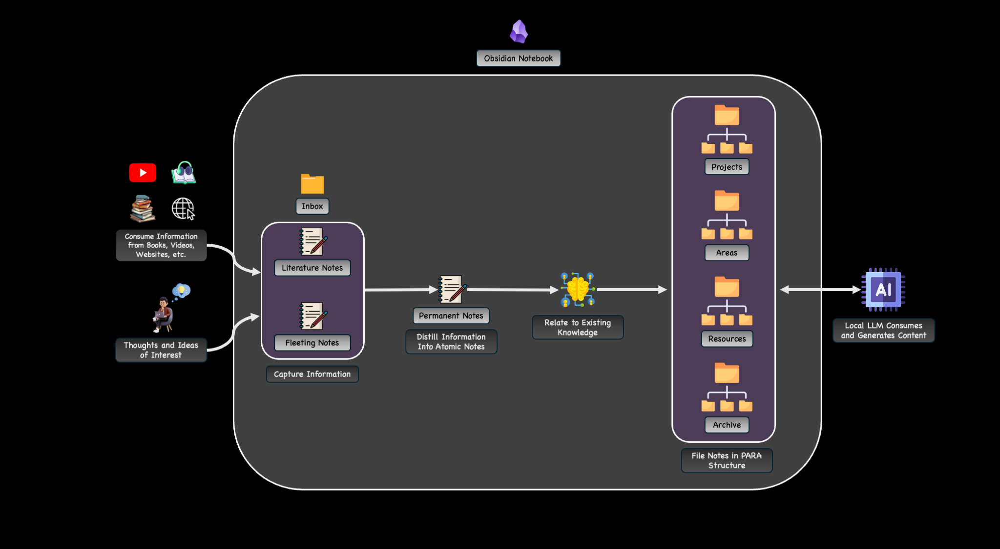
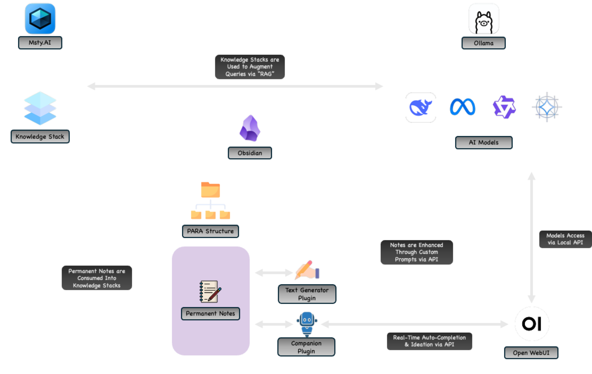

[← Back to Home](./index.md)

# Knowledge Systems & Second Brain

This page highlights how I use Obsidian, PARA + Zettelkasten principles, and AI-augmented workflows to build a structured, resilient knowledge system. My setup integrates local LLMs running in my homelab, automated note pipelines, and a tightly linked network of evergreen notes that support learning, research, and design work.

---

## Architectural Overview

My knowledge system combines Obsidian’s flexibility with PARA for structure, Zettelkasten for idea development, and locally run AI models for synthesis and retrieval. This creates an environment where information flows smoothly from capture to long-term understanding.



*Figure: High-level architecture showing how PARA, Zettelkasten, and AI tools interact.*

---

## PARA Organizational Structure

PARA provides the **spatial organization** of my vault: where information lives and how it moves.

### **P — Projects**  
Short-term efforts with a clear outcome or deliverable.  
Examples in my vault:
- AI/ML Model Development  
- Proxmox Cluster Upgrades  
- MikroTik VRRP & CAPsMAN Design  
- AWS DevOps Engineer Professional Prep  
- Raspberry Pi Greenhouse Automation  

Each project folder includes:
- Project brief  
- Objectives and milestones  
- Technical design notes  
- Related diagrams  
- AI-assisted summaries  

### **A — Areas**  
Long-term responsibilities that require ongoing attention.  
Examples:
- Cloud Architecture  
- Network Automation  
- Homelab Operations 
- Academic Research  
- Writing & Thought Leadership  

Areas contain:
- Evergreen notes  
- Standards, procedures, and reference checklists  
- Conceptual overviews that evolve over time  

### **R — Resources**  
Reference material with intrinsic value but no active project.  
Examples:
- Machine Learning theory  
- Python patterns  
- Zettelkasten techniques  
- Terraform & Ansible design patterns  
- Networking protocols  
- Homelab hardware documentation  

These notes often become **sources** for Zettelkasten permanent notes.

### **A — Archives**  
Inactive or completed items.  
Examples:
- Retired architecture diagrams  
- Completed certifications  
- Finished academic course notes  
- Deprecated tooling  

This keeps the active vault lightweight and fast.

---

## Zettelkasten Note-taking Philosophy

While PARA determines *where* things go, Zettelkasten determines *how ideas connect*.  
I maintain the classic Zettelkasten note taxonomy:

### **Fleeting Notes**
Raw thoughts captured during reading, troubleshooting, or ideation.

### **Literature Notes**
Summaries of books, articles, academic papers, documentation, or research.

### **Permanent Notes (Evergreen Notes)**
Atomic, concept-based notes written in my own words and linked bidirectionally.

These notes include:
- Concept explanations  
- Architecture ideas  
- AI model design insights  
- Lessons from experiments  
- Domain knowledge (networking, cloud, homelab work)

Example link relationships:

```
[[deep-learning-regularization]]
[[terraform-immutable-infrastructure]]
[[vrrp-failover-design]]
[[local-llm-inference-patterns]]
```

Zettelkasten creates a **dense web of ideas**, while PARA keeps everything **navigable and organized**.

---

## AI-Augmented Knowledge Workflows

AI plays a central role in accelerating synthesis and retrieval.

### **Text Generator Plugin**
- Summaries  
- Note restructuring  
- Extracting atomic notes  
- Turning rough text into formal notes  
- Drafting outlines for research or articles  

### **Companion Plugin**
- Inline autocomplete  
- Context-aware suggestions  
- Real-time ideation while writing  

### **Msty.AI Contextual Retrieval**
- Embedding-based semantic search  
- Knowledge stack querying  
- Automatic resurfacing of related notes  
- Local inference through OpenWebUI/Ollama  

### **Local LLM Integration (Homelab)**
Running models such as:

- DeepSeek-R1  
- LLaMA variants  
- Code-oriented models  
- Lightweight reasoning models  

via:

- Proxmox VMs & LXCs  
- OpenWebUI  
- Ollama API endpoints



*Figure: Integration between Obsidian, Msty, Companion, and local LLMs running in my home network.*

---

## Automated Note Pipelines

Automation reduces manual overhead and keeps information flowing consistently.

### **Examples of automated workflows**
- Summarize long documents into Literature Notes  
- Extract atomic Zettels from articles or PDFs  
- Generate project documentation from rough notes  
- Create daily journal summaries with key insights  
- Auto-generate backlinks based on semantic similarity  
- Maintain project → area → resource link consistency  

These pipelines keep the vault accurate, complete, and interconnected.

---

## Practical Examples of PARA + Zettelkasten in Action

### **1. Academic Research**
Used for:
- Literature management  
- Model design documentation  
- Experiments and evaluations  
- Tracking CNN & NB model iterations  

### **2. Homelab Projects**
Organizes:
- Proxmox cluster notes  
- TrueNAS SCALE design  
- Mikrotik VRRP + CAPsMAN configuration  
- Incus & LXC container orchestration  
- Terraform & Ansible workflows  

### **3. Maker & Automation Projects**
Captures:
- Raspberry Pi greenhouse design logic  
- Ham radio APRS diagrams  
- AI-driven greenhouse controls  
- GPIO mapping and automation flows  

---

## Tools & Platforms Supporting the System

- **Obsidian**  
- **Zettelkasten method**  
- **PARA organizational structure**  
- **Text Generator & Companion plugins**  
- **Msty.AI retrieval engine**  
- **Local LLMs via Ollama**  
- **OpenWebUI**  
- **Proxmox VE & TrueNAS SCALE**  
- **Incus & LXC containers**  
- **Python utilities for automated note processing**

---

## Why This System Works

This knowledge system is a force multiplier that enables me to:

- Connect new ideas to existing knowledge  
- Perform fast retrieval over large information volumes  
- Support academic writing with structured research  
- Maintain evergreen documentation across projects  
- Build complex systems with clear traceability  
- Amplify critical thinking through AI assistance  

It integrates my technical background, homelab capabilities, academic work, and personal research/experimentation into a unified, scalable knowledge ecosystem.

<div class="page-footer">
  <a class="page-back" href="{{ '/' | relative_url }}">← Back to Home</a>
  <span class="page-updated">
    Last updated: {{ page.last_updated }}
  </span>
</div>